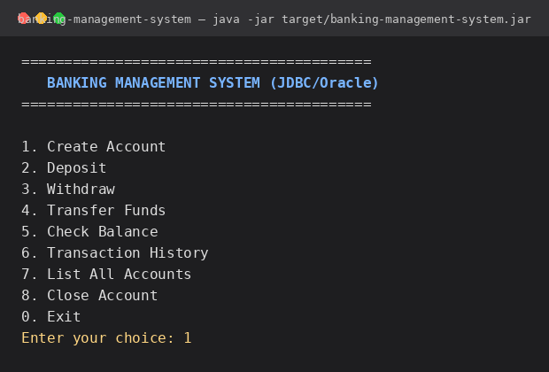
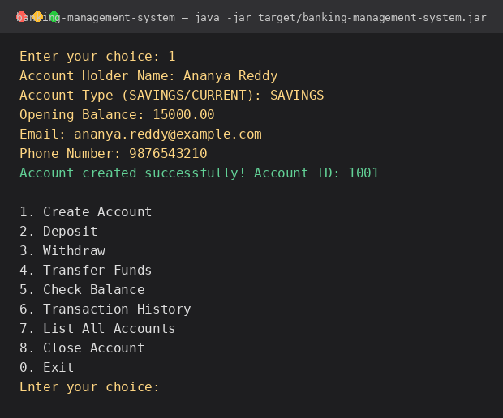
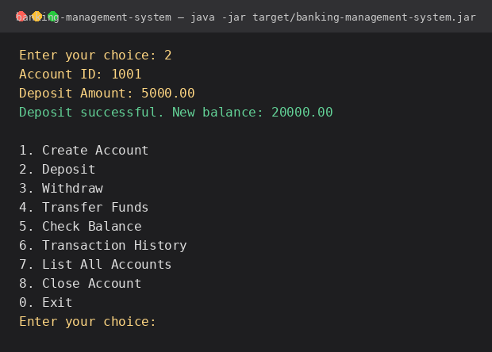
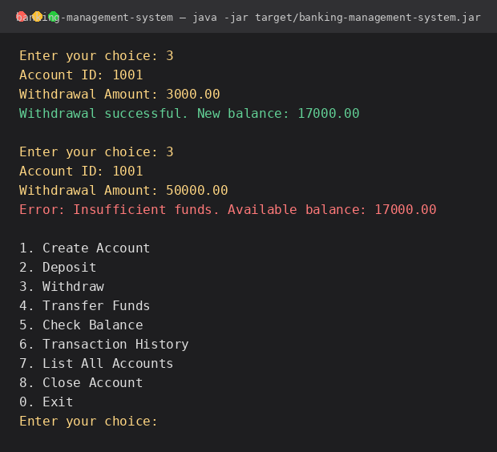
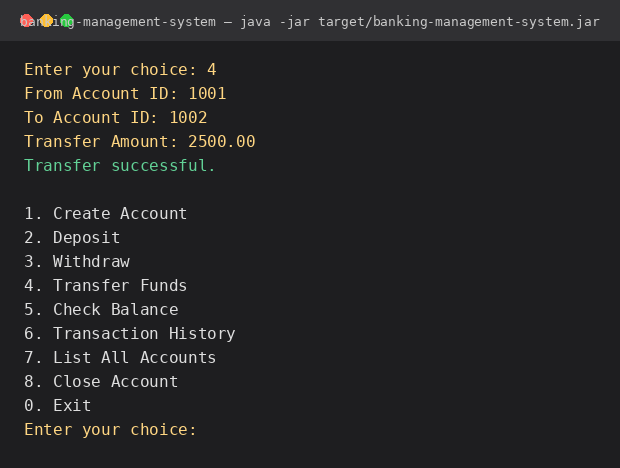
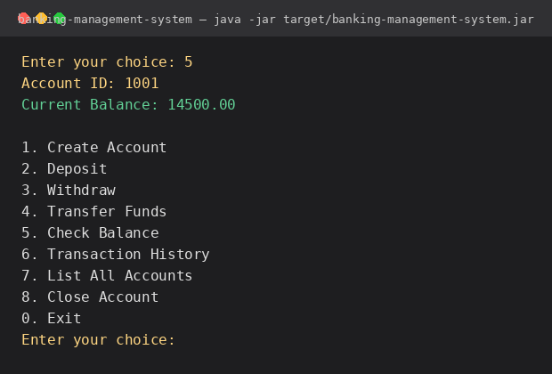
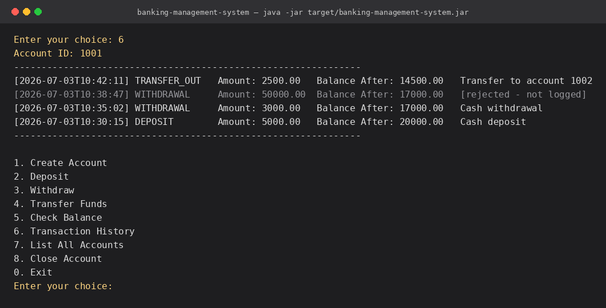
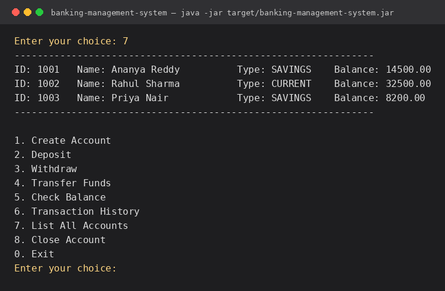
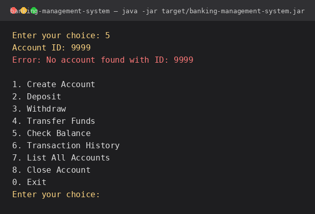

# 🏦 Banking Management System

A console-based banking application built with **Java, JDBC, and Oracle Database**, demonstrating the **DAO pattern**, **layered architecture**, and safe **transaction management**. Designed as a clean, portfolio-ready example of core Java + relational database fundamentals.

## ✨ Features

- **Account Management** — create accounts, view account details, list all accounts, close accounts
- **Deposits & Withdrawals** — with validation and insufficient-funds protection
- **Fund Transfers** — atomic transfer between two accounts (all-or-nothing)
- **Balance Inquiry** — instant balance lookup by account ID
- **Transaction History** — full audit trail per account (deposits, withdrawals, transfers)
- **Robust Exception Handling** — custom checked exceptions for business-rule violations (`InsufficientFundsException`, `AccountNotFoundException`, `InvalidAmountException`)
- **ACID-safe operations** — multi-step operations (e.g. transfers) run inside a single JDBC transaction with commit/rollback, so partial failures never corrupt data

## 🛠 Tech Stack

| Layer          | Technology                          |
|----------------|--------------------------------------|
| Language       | Java 17                              |
| Database       | Oracle Database (11g/12c/19c/XE/23ai)|
| Connectivity   | JDBC (`ojdbc11`)                     |
| Build Tool     | Maven                                |
| Design Pattern | DAO (Data Access Object)             |

## 🏗 Architecture

The project follows a clean, layered architecture so each concern is isolated and independently testable:

```
com.banking
├── Main.java              # Presentation layer - console menu / entry point
├── service/                # Business logic + transaction (commit/rollback) management
│   └── BankingService.java
├── dao/                    # Data Access Object layer - one interface + impl per entity
│   ├── AccountDAO.java
│   ├── AccountDAOImpl.java
│   ├── TransactionDAO.java
│   └── TransactionDAOImpl.java
├── model/                  # Plain data model classes (POJOs)
│   ├── Account.java
│   └── Transaction.java
├── db/                     # JDBC connection management
│   └── DBConnection.java
├── exception/               # Custom checked exceptions
│   ├── AccountNotFoundException.java
│   ├── InsufficientFundsException.java
│   └── InvalidAmountException.java
└── util/                   # Small shared helpers (input validation)
    └── InputValidator.java
```

**Flow:** `Main` (UI) → `BankingService` (business rules + transactions) → `AccountDAO` / `TransactionDAO` (SQL) → Oracle Database.

## 📂 Project Structure

```
BankingManagementSystem/
├── pom.xml
├── README.md
├── LICENSE
├── .gitignore
├── sql/
│   └── schema.sql                          # DDL: tables, sequences, constraints
└── src/main/
    ├── java/com/banking/...                # Source code (see architecture above)
    └── resources/
        └── db.properties.example           # Copy to db.properties and fill in credentials
```

## 🚀 Getting Started

### Prerequisites

- JDK 17+
- Maven 3.8+
- Oracle Database (Express Edition / XE works fine for local development)

### 1. Clone the repository

```bash
git clone https://github.com/<your-username>/banking-management-system.git
cd banking-management-system
```

### 2. Create the database schema

Connect to your Oracle instance (e.g. via SQL*Plus or SQL Developer) as your target schema user and run:

```bash
sql your_username/your_password@localhost:1521/XE @sql/schema.sql
```

This creates the `ACCOUNTS` and `TRANSACTIONS` tables along with their sequences, constraints, and an index on `transactions.account_id`.

### 3. Configure database credentials

```bash
cp src/main/resources/db.properties.example src/main/resources/db.properties
```

Edit `src/main/resources/db.properties` with your own connection details:

```properties
db.driver=oracle.jdbc.driver.OracleDriver
db.url=jdbc:oracle:thin:@localhost:1521:XE
db.user=your_username
db.password=your_password
```

> `db.properties` is listed in `.gitignore` so your real credentials are never committed — only the `.example` template is tracked.

### 4. Build

```bash
mvn clean package
```

This produces a runnable fat JAR at `target/banking-management-system-jar-with-dependencies.jar`.

> **Note on the Oracle driver:** Oracle's JDBC driver is published under Oracle's own terms and may not resolve from Maven Central in every environment. If `mvn clean package` fails to download `ojdbc11`, download it directly from the [Oracle JDBC downloads page](https://www.oracle.com/database/technologies/appdev/jdbc-downloads.html) and either install it into your local Maven repo (`mvn install:install-file ...`) or place the JAR on your classpath manually.

### 5. Run

```bash
java -jar target/banking-management-system-jar-with-dependencies.jar
```

You'll be greeted with a text menu:

```
=========================================
   BANKING MANAGEMENT SYSTEM (JDBC/Oracle)
=========================================

1. Create Account
2. Deposit
3. Withdraw
4. Transfer Funds
5. Check Balance
6. Transaction History
7. List All Accounts
8. Close Account
0. Exit
Enter your choice:
```

## 🖥 Output Screens

**Main Menu**



**Create Account**



**Deposit**



**Withdraw (including insufficient-funds handling)**



**Transfer Funds**



**Balance Inquiry**



**Transaction History**



**List All Accounts**



**Error Handling — Invalid Account ID**



> These are illustrative sample runs showing expected console output for each menu option. Swap them out with real screenshots from your own local run once you have the app connected to your Oracle instance.

## 🗄 Database Schema

**ACCOUNTS**

| Column               | Type          | Notes                          |
|----------------------|---------------|---------------------------------|
| account_id            | NUMBER        | PK, populated via sequence      |
| account_holder_name   | VARCHAR2(100) | NOT NULL                        |
| account_type          | VARCHAR2(20)  | `SAVINGS` or `CURRENT`          |
| balance                | NUMBER(15,2)  | CHECK (balance >= 0)            |
| email                  | VARCHAR2(100) |                                  |
| phone_number           | VARCHAR2(20)  |                                  |
| created_date           | TIMESTAMP     | Defaults to `SYSTIMESTAMP`      |

**TRANSACTIONS**

| Column             | Type          | Notes                                                  |
|--------------------|---------------|---------------------------------------------------------|
| transaction_id      | NUMBER        | PK, populated via sequence                               |
| account_id          | NUMBER        | FK → `accounts.account_id` (`ON DELETE CASCADE`)         |
| transaction_type    | VARCHAR2(20)  | `DEPOSIT` / `WITHDRAWAL` / `TRANSFER_IN` / `TRANSFER_OUT` |
| amount              | NUMBER(15,2)  | CHECK (amount > 0)                                       |
| balance_after       | NUMBER(15,2)  | Account balance immediately after this transaction       |
| remarks             | VARCHAR2(200) |                                                            |
| transaction_date    | TIMESTAMP     | Defaults to `SYSTIMESTAMP`                                |

## 🔒 Transaction Management & Error Handling

- Every multi-step operation (deposit, withdrawal, transfer) runs with `autoCommit` disabled — the balance update and the transaction log insert are committed together, or rolled back together on any failure.
- Withdrawals and transfers validate sufficient funds **before** touching the database and throw `InsufficientFundsException` if the check fails.
- All DAO methods declare `SQLException`, so persistence errors propagate cleanly to the service layer, which coordinates rollback, and finally to `Main`, where they're caught and shown to the user as friendly error messages instead of crashing the app.

## 🧭 Possible Enhancements

- Swap the console UI for a REST API (Spring Boot) or JavaFX desktop UI
- Add a connection pool (HikariCP) instead of a single shared `Connection`
- Add unit tests with an in-memory/mock DAO layer (JUnit + Mockito)
- Add pagination for transaction history and account listings
- Add interest calculation for savings accounts (scheduled job)

## 📄 License

This project is licensed under the [MIT License](LICENSE).
